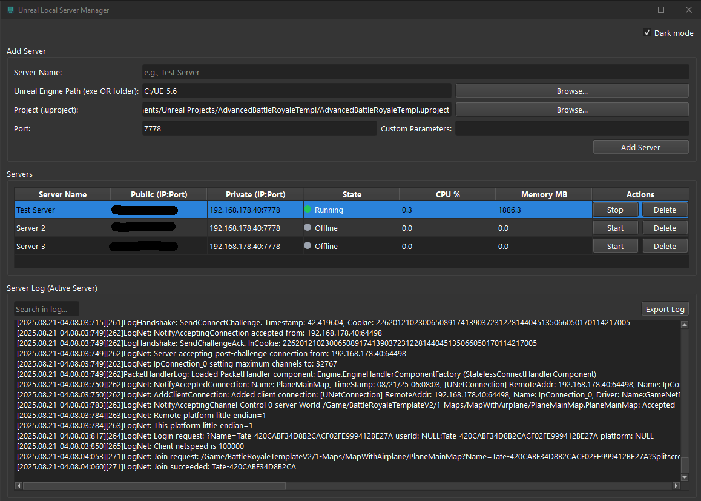

# Unreal Local Server Manager

This is a Python-based application that allows users to easily host and manage local dedicated servers for Unreal Engine projects.



## Features

- Add/Remove servers
- Start/Stop servers
- Display logs of running servers
- Monitor CPU, Memory usage, and server state
- Search logs
- Custom server parameters
- Dark mode support

## Installation

### Requirements

If you decide to use the script, make sure you have Python 3.6+ installed on your machine. You'll also need `pip` for installing dependencies.

### Steps to Set Up

1. **Clone the repository**:

    ```bash
    git clone https://github.com/TateMat99/UnrealLocalServerManager.git
    cd UnrealLocalServerManager
    ```

2. **Create a virtual environment**:

    ```bash
    python -m venv .venv
    ```

3. **Activate the virtual environment**:

    - **Windows**:

      ```bash
      .venv\Scripts\Activate.bat
      ```

4. **Install dependencies**:

    ```bash
    pip install -r requirements.txt
    ```

### Running the Application

1. **Run the program**:

    ```bash
    python run.py
    ```

## Building an Executable

To generate the **.exe** file:

1. Ensure you have PyInstaller installed:

    ```bash
    pip install pyinstaller
    ```

2. Build the EXE:

    ```bash
    python -m PyInstaller --noconfirm --clean --name "UnrealLocalServerManager" --onefile --windowed --icon "app.ico" --hidden-import "PySide6.QtCore" ^ --hidden-import "PySide6.QtGui" ^ --hidden-import="uuid" ^ --hidden-import "PySide6.QtWidgets" ^ ".\run.py"
    ```

3. The built EXE will be located in the `dist/` folder.

## **How to Use:**

1. **Configure Your Server:**
   - Browse for your **Unreal Engine folder**, **UnrealEditor.exe**, or **server binaries**.
   - For the **project**, find the `.uproject` file for the Unreal Engine project you want to use.

2. **Port and Custom Parameters:**
   - The default **port** will always be `7777`, but you can change it as needed.
   - You can also **add custom parameters** for your server if necessary.

3. **Add Server:**
   - Once you've configured your server, click the **"Add Server"** button. This will add the server to the server list and **automatically save** the configuration.

4. **Starting and Connecting:**
   - From the server list, simply click on the **"Start"** button to launch your server.
   - To connect to the server from your client, click on either the **public IP** or **local IP**, and it will automatically **copy the value to your clipboard** for easy pasting.

## **Notes:**
- If you **close the program**, any running servers will automatically **shut down** as well.
- If the **SmartScreen warning** appears the first time you run the application, click **"More info"** and then **"Run anyway"** to proceed.

